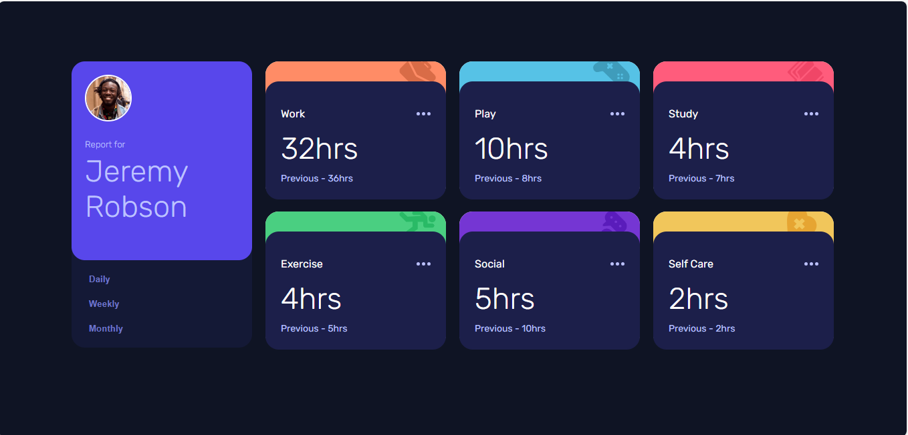

# Frontend Mentor - Time tracking dashboard

This is a solution to the [Time tracking dashboard](https://www.frontendmentor.io/challenges/time-tracking-dashboard-UIQ7167Jw). Frontend Mentor challenges help you improve your coding skills by building realistic projects.

## Table of contents

- [Overview](#overview)
  - [The challenge](#the-challenge)
  - [Screenshot](#screenshot)
  - [Links](#links)
  - [Installation](#Installation)
  - [Usage](#Usage)
- [My process](#my-process)
  - [Built with](#built-with)
  - [What I learned](#what-i-learned)
  - [Continued development](#continued-development)
- [Author](#author)
- [Acknowledgments](#Acknowledgments)

## Overview

### The challenge

A perfect opportunity to practice your CSS Grid skills. For anyone wanting to take it up a notch.

Your users should be able to:

- Switch between viewing Daily, Weekly, and Monthly stats
- View the optimal layout for the site depending on their device's screen size
- See hover states for all interactive elements on the page

### Screenshot



### Links

- Solution URL: [here](https://github.com/olahasan/HTML_CSS_AND_J.S_Frontend_Mentor_JUNIOR-Time-tracking-dashboard)

- Live Site URL: [here](https://olahasan.github.io/HTML_CSS_AND_J.S_Frontend_Mentor_JUNIOR-Time-tracking-dashboard/)

## Installation

To get a local copy up and running, follow these simple steps:

1. **Clone the repository**:

   ```sh
   git clone https://github.com/your-username/your-repo-name.git
   ```

2. **Navigate to the project directory**:

   ```sh
   cd your-repo-name
   ```

3. **Open the project in your preferred code editor**.

## Usage

- Press the buttons (daily, weekly, monthly) to switch between data

## My process

### Built with

- Semantic HTML5 markup
- CSS custom properties
- Flexbox
- CSS Grid
- Mobile-first workflow
- JavaScript for interactivity

### What I Learned

In this project, I learned how to:

- Use CSS Grid to create a responsive layout.
- Implement event delegation in JavaScript to handle multiple button clicks efficiently.
- Utilize CSS variables for maintaining a consistent color scheme.

### Continued Development

In future projects, I plan to:

- Explore more advanced JavaScript features and frameworks.
- Improve accessibility by using ARIA roles and properties.
- Enhance the user experience with animations and transitions.

### Author

Frontend Mentor - @olahasan<br>
GitHub - @olahasan

### Acknowledgments

I would like to thank the **Frontend Mentor** for providing this challenge and to the community for their support and feedback
